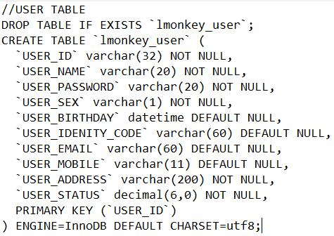

# Java-E-commerce-Platform-Project

Tools:
1. Java EE(Tomcat Server, Java Servlet, JSP, JavaSE, JDBC)
2. SQL(MySQL Database)
3. XML
4. JavaScript, HTML, CSS

Architecture:

Main Features:
1. Project demand breakdown and basic environment construction
2. The actual development process of the user module
3. Standard project registration and login process implementation
4. Front menu design and implementation of classification module
5. Commodity module and front-end merchandise display design and implementation
6. Design and implementation of shopping process

day 1:
1. Create User Infromation table and import to the MySQL 

2. Create the User Information Java Beans(LMONKEY_USER.java)
3. User Module(CRUD)
4. coded jsp sevelet userDao to achieve user update MySQL

day 2:
1. coded query from the MySql
2. split the pages for ResultSet
3. query based on user search

day 3:
1. coded user information modifier

day 4:
1. coded delete one record or multiple records

day 5:
1. update user registration UI

day 6:
1. implemneted verification generator
2. updated the front-end verification

day 7:
1. implmented js code check username password repassword and verify code is not null
2. implmented Ajax code check the use_ID unique (connect MySQL check) and verify code correction.

3/22:
1. Front-end Verification finished

3/24
1. Add the servlet filter to check the informmation correctness
2. Implemented the Login page(Login.jsp login.sevelet)
3. Modified the Personal Information Page

4. Impemented normal user login(Login servlet) logout(logout servlet)

3/25
1. Modified the administrator login(login Servlet) logout(logout servlet)

2. Implemented the administrator filter to protect administrator web page need login to access.

3/26
1. Create the category table and immport to the Mysql database

3/27
1. Create the Category Java Bean(LMONKEY_CATEGORY.java)
2. Create Category Query

3. Create Category Add

3/28
1. Impemented the Category modified function

2. Implemented the Category delete (need more work on this part skip it today) 

3/29
1. Update the home page category
2. Create the Product information table and immport to the Mysql database

3. Create the product Java Bean(LMONKEY_PRODUCT.java)

3/30
1. Updated the product(book) add page and servlets to help this page get information from the database

3/31
1. Implemmented the add new product function since this time need upload the file to the project, so import the external jar pakage(smartupload.jar)
2. Implemented the Product(book) information Query and display on the web page.
