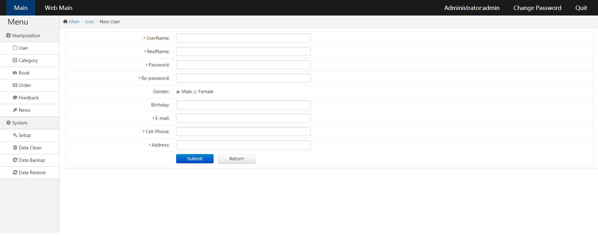

# Java-E-commerce-Platform-Project
# TomCat Server MySql JSP Java Sevelet B/S System

day 1:
1. User Module(CRUD)
2. coded jsp sevelet userDao to achieve user update MySQL

day 2:
1. coded query from the MySql
2. split the pages for ResultSet
3. query based on user search

day 3:
1. coded user information modifier

day 4:
1. coded delete one record or multiple records

day 5:
1. update user registration UI

day 6:
1. implemneted verification generator
2. updated the front-end verification

day 7:
1. implmented js code check username password repassword and verify code is not null
2. implmented Ajax code check the use_ID unique (connect MySQL check) and verify code correction.

